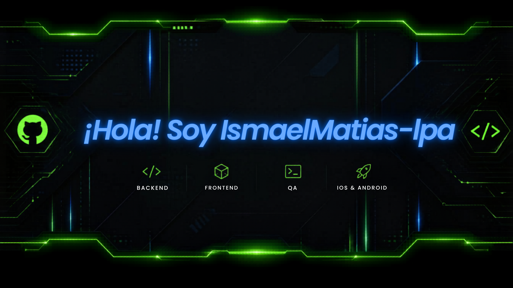

  

<h1 align="center">👋 Hi! I'm IsmaelMatias-Ipa</h1>

====================================================================
 
I am a Software Development student focused on building Full-Stack solutions and Quality Assurance (QA). I am passionate about solving complex problems, designing robust architectures, and exploring test automation to deliver high-standard software.

- 🔭 Currently working on: **[Project Name]**
- 🎓 Student at: **Cibertec**
- ⚡ Fun fact: **[]**
 
====================================================================

---

## 🚀 Technologies & Tools

### 💻 Development Stack

### ⚙️ Automation & QA

### 🌱 What I am learning (Or looking to learn)
* ☁️ Cloud Architectures (AWS, Azure)
* 🔄 Continuous Integration & Continuous Delivery (CI/CD)
* 📱 Advanced design patterns for mobile applications
* 🤖 AI Agent Engineering
* 🧠 AI Solutions Development

---

## 📂 Featured Projects

  <table width="100%">
    <tr>
      <td width="50%" align="center">
        <strong>📌 MentorMatch</strong>  
         
        <a href="https://github.com/IsmaelMatias-Ipa/MentorMatch">🚀 View Repository</a>
      </td>
      <td width="50%" align="center">
        <strong>📌 WorkDSWII</strong>  
         
        <a href="https://github.com/IsmaelMatias-Ipa/WorkDSWII">🚀 View Repository</a>
      </td>
    </tr>
    <tr>
      <td width="50%" align="center">
         <strong>📌 Shopping Cart Automation</strong>  
         
        <a href="https://github.com/IsmaelMatias-Ipa/Shopping-Cart-Appium">🚀 View Repository</a>
      </td>
      <td width="50%" align="center">
         <strong>📌 Pharmacy Management</strong>  
         
        <a href="https://github.com/IsmaelMatias-Ipa/Pharmacy-Management">🚀 View Repository</a>
      </td>
    </tr>
  </table>

---

## 📫 Connect with me

  
  
  

